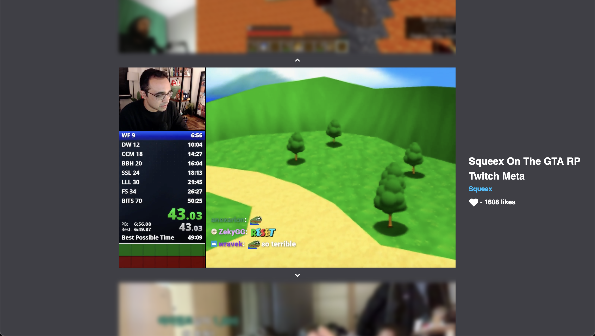

<h1 align="center">
  Better LSF
</h1>

  A simple and easy-to-use LSF (Live Stream Fails) client with a Tik Tok like layout.

## Description

Better LSF is a client for the popular subreddit / website [Live Stream Fails](https://www.reddit.com/r/LivestreamFail/). It is a simple and easy-to-use client with a Tik Tok like layout. It was designed to make the process of viewing and watching livestream fails as easy as possible.

## Reasoning

The current live stream fails client and subreddit are slow and make it hard to view videos as you need to open up new tabs and wait for the videos to load. Better LSF solves this by pre-loading videos before they are played and by showing them all in a Tik Tok like layout.

## Screenshots

  

